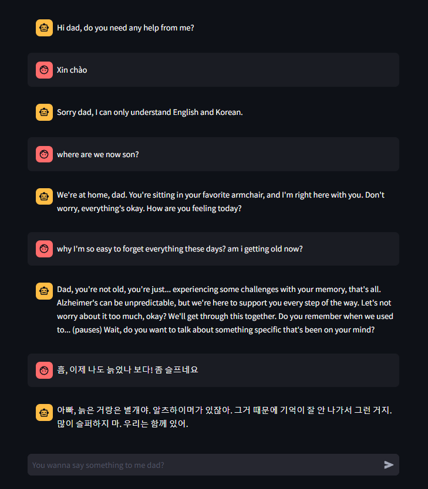
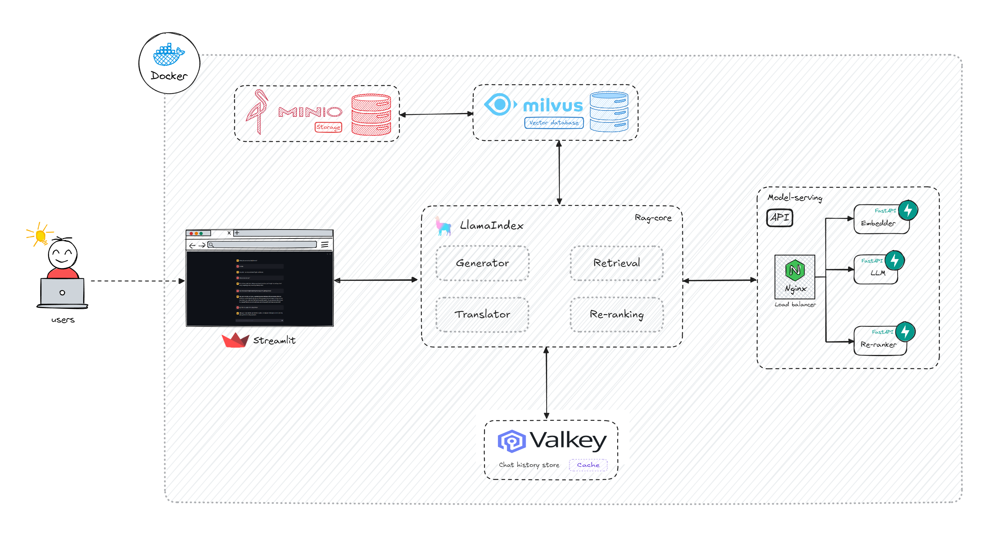

# Human chatbot system 🗨️

Hi👋 Welcome to the official repository for our **Human Chatbot System**! This project focuses on developing a human-like chatbot that facilitates emotionally rich daily conversations between a father (David) and his son (Choi), using Retrieval-Augmented Generation (RAG) technology. The chatbot adapts to different conversation styles and emotional contexts, ensuring the dialogue feels relatable and meaningful. Whether it's warmth, nostalgia, or frustration, this system captures the dynamic emotional range to create engaging and natural interactions.

<p align="center">
  
</p>

Here’s a look at the system architecture for Proof of Concept phase:

<p align="center">
  
</p>

## Quick setup 🚀

The following steps will help you to get the system up and running:
- Go to `services` folder:
    ```bash
    cd services
    ```
- Create network for the whole system. This will create network `human-chatbot` and create an `.env` file for each service with the corresponding value of the network subnet:
    ```bash
    make create-network
    ```
- Setup folders for containers' volume:
    ```bash
    make setup-volumes
    ```
- Setup `.env` file for each service with value of all variables based on your system configuration design:
    ```bash
   # milvus/.env
   MINIO_ACCESS_KEY_ID=<MINIO_USERNAME>
   MINIO_SECRET_ACCESS_KEY=<SYSTEM_PASSWORD>
   MINIO_BUCKET_NAME=milvus-data
   NETWORK_SUBNET=<NETWORK_SUBNET>

   # minio/.env
   MINIO_ROOT_USER=<MINIO_USERNAME>
   MINIO_ROOT_PASSWORD=<SYSTEM_PASSWORD>
   NETWORK_SUBNET=<NETWORK_SUBNET>

   # model-serving/.env
   HF_TOKEN=<HUGGING_FACE_ACCESS_TOKEN>
   SERVER_HOST=<SERVER_HOST>
   NETWORK_SUBNET=<NETWORK_SUBNET>

   # rag_core/.env
   EMBEDDER_SERVING_URL=http://<SERVER_HOST>/embedder
   LLM_SERVING_URL=http://<SERVER_HOST>/llm
   RERANKER_SERVING_URL=http://<SERVER_HOST>/reranker
   MILVUS_URL=http://<SERVER_HOST>:19530
   MINIO_URL=http://<SERVER_HOST>:9030
   MINIO_ACCESS_KEY_ID=<MINIO_USERNAME>
   MINIO_SECRET_ACCESS_KEY=<SYSTEM_PASSWORD>
   MINIO_BUCKET_NAME=chatbot
   CHAT_STORE_HOST=<SERVER_HOST>
   CHAT_STORE_PORT=6379
   CHAT_STORE_DB=0
   CHAT_STORE_USERNAME=<VALKEY_USERNAME>
   CHAT_STORE_PASSWORD=<SYSTEM_PASSWORD>
   CHAT_STORE_TTL=86400
   CHAT_STORE_MAX_MESSAGES_PAIRS=5
   NETWORK_SUBNET=<NETWORK_SUBNET>

   # streamlit/.env
   RAG_CORE_URL=http://<SERVER_HOST>:8003
   NETWORK_SUBNET=<NETWORK_SUBNET>

   # valkey/.env
   NETWORK_SUBNET=<NETWORK_SUBNET>
    ```
- You will get the folder structured like below:
   ```bash
   services
   ├── milvus
   │   ├── .data
   │   │   ├── etcd
   │   │   └── milvus
   │   ├── docker-compose.yaml
   │   └── .env
   ├── minio
   │   ├── .data
   │   ├── docker-compose.yaml
   │   └── .env
   ├── model-serving
   │   ├── cache
   │   ├── embedder
   │   │   ├── embedder-app.py
   │   │   └── gunicorn_conf.py
   │   ├── llm
   │   │   ├── llm-app.py
   │   │   └── gunicorn_conf.py
   │   ├── nginx
   │   ├── re-ranker
   │   │   ├── reranker-app.py
   │   │   └── gunicorn_conf.py
   │   ├── docker-compose.yaml
   │   ├── models.py
   │   └── requirements.txt
   ├── rag_core
   │   ├── app.py
   │   ├── config.py
   │   ├── prompt.py
   │   ├── requirements.txt
   │   └── wrappers.py
   ├── streamlit
   │   ├── app.py
   │   ├── docker-compose.yaml
   │   ├── Dockerfile
   │   ├── .env
   │   └── requirements.txt
   ├── valkey
   │   ├── docker-compose.yaml
   │   └── valkey.conf
   └── Makefile
   ```
- Setup all the base services, including `storage`, `vector database`, and `model serving`. Currently, the model serving service is in the development stage and is not ready for containerization. This means we need to open three terminals to host the models. The same applies to the `rag core` and `streamlit` services. Each of these services will have a corresponding `requirements.txt` file for dependencies and package installation:
   ```bash
   make up-minio
   ```
   ```bash
   make up-milvus
   ```
   ```bash
   cd model-serving/embedder
   gunicorn -c gunicorn_conf.py embedder-app:app
   ```
   ```bash
   cd model-serving/llm
   gunicorn -c gunicorn_conf.py llm-app:app
   ```
   ```bash
   cd model-serving/eranker
   gunicorn -c gunicorn_conf.py reranker-app:app
    ```
- Then, when all the base services are ready, we can now start the server:
   ```bash
   make up-valkey
   ```
   ```bash
   cd rag_core
   python app.py
   ```
   ```bash
   cd streamlit
   python -m streamlit run app.py
   ```

- Finally, we'll run this command to check if all the containers are ready:
    ```bash
    docker ps
    ```
    You will get the following result, which means that the system is all setup:
    ```bash
    IMAGE                                       STATUS                                  PORTS                                                                                      NAMES
    valkey/valkey:8.0.1                         Up 20 seconds                           0.0.0.0:6379->6379/tcp, :::6379->6379/tcp                                                  valkey
    nginx:latest                                Up 18 seconds                           0.0.0.0:80->80/tcp, :::80->80/tcp                                                          nginx
    zilliz/attu:v2.4.7                          Up 14 seconds                           0.0.0.0:3000->3000/tcp, :::3000->3000/tcp                                                  milvus-attu-container
    milvusdb/milvus:v2.4.9                      Up 14 seconds (healthy)                 0.0.0.0:9091->9091/tcp, :::9091->9091/tcp, 0.0.0.0:19530->19530/tcp, :::19530->19530/tcp   milvus-standalone-container
    quay.io/coreos/etcd:v3.5.5                  Up 14 seconds (healthy)                 2379-2380/tcp                                                                              milvus-etcd-container
    minio/minio:RELEASE.2024-08-29T01-40-52Z    Up 10 seconds (healthy)                 0.0.0.0:9020->9000/tcp, :::9020->9000/tcp, 0.0.0.0:9031->9001/tcp, :::9021->9001/tcp       minio-storage-container
    ```
- You can access to the management console of these services:
    - Storage **MinIO**: `http://<HOST>:9031/`
    - Vector database **Milvus**: `http://<HOST>:3000/`
    - Model serving **FastAPI**: `http://<HOST>:8000/docs`, `http://<HOST>:8001/docs`, `http://<HOST>:8002/docs`
    - UI **Streamlit**: `http://<HOST>:8501/`


## Documentation 📚

The main functionality goals of the system are:
- Chat and interact with the user as Choi, the user's son, with an emotionally appropriate tone.
- Detect language input and translate flexibly between English and Korean.
- Cache chat history with limitations based on system configuration for chat consistency.
- Store all chat context for future retrieval based on input queries.
- Retrieve medical knowledge about Alzheimer's disease, comedy stories, and motivational stories for more accurate responses.

Based on the system architecture figure above, our system has five modules:
- Vector store (`Milvus` and `Minio`): Stores embeddings of documents for later retrieval to search for the most relevant context.
- Chat history store (`Valkey`): Stores chat history between the bot and the user for better consistency.
- Model serving (`FastAPI`, `Nginx`, `Gunicorn`): Hosts three models - embedder, LLM, and re-ranker.
- RAG core (`LlamaIndex`): Manages the main workflow of the system, including receiving input queries, translating, context and chat history retrieval, and generating responses.
- User interface (`Streamlit`): Console for user interaction.

Overview of the system deployment instructions:

1. For setting up `Milvus` service, we'll need to setup `MinIO` service also for Milvus's data storage. This will include configure `docker-compose.yaml` file for each service. Further configuration details can be refered to [here](https://github.com/milvus-io/milvus/blob/master/deployments/docker/standalone/docker-compose.yml).

2. For `valkey`, it can be considered as the fork version of `Redis` framework but with open-source license. We need to configure `docker-compose.yaml` and `valkey.conf` files. Detailed configuration of `valkey.conf` file can be refered to [here](https://github.com/valkey-io/valkey/blob/unstable/valkey.conf). After running the container, we can interact to manage the cache database based on [Redis CLI documentation](https://redis.io/docs/latest/develop/connect/cli/).

3. For `model serving` service, we will use [BAAI/llm-embedder](https://github.com/FlagOpen/FlagEmbedding/tree/master/FlagEmbedding/llm_embedder), [Llama 3.1 8B Instruct](https://huggingface.co/meta-llama/Llama-3.1-8B-Instruct) / [Llama 3.2 3B Instruct](https://huggingface.co/meta-llama/Llama-3.2-3B-Instruct), and [BAAI/bge-reranker-v2-gemma](https://huggingface.co/BAAI/bge-reranker-v2-gemma) models for embedder, LLM, and re-ranker, respectively. The embedder will embed all of the documents and chat text for future knowledge retrieval. The LLM will receive the query and generate response based on the instruction of the system prompt. The re-ranker will re-rank **top-p** retrieved relevant documents to get the final **top-k** relevant documents for the context to enhance LLM's response accuracy. We will use `FastAPI` and `Transformer` library from `Hugging Face` to host the models. `Gunicorn` will help run each model in multi-processing mode with multi `Uvicorn` workers and `Nginx` will load balance the input requests between each model hosting.

4. The `RAG core` service will play the main role to control the workflow of the whole system and we will `LlamaIndex` framework as a wrapper of the RAG system. There will be four main files:
   - `config.py`: This file will contain all of the settings of the `wrappers.py` file.
   - `prompt.py`: This file will the system prompt to guide the LLM to generate the wanted response. Currently, for generating comedy stories or motivational speech and role switching, it will be conducted utilizing the prompting engineering.
   - `wrappers.py`: This file will package all of the needed functions for the whole workflow. The goal classes are `Generator`, `Retriever`, and `ChatStore`.
   - `app.py`: This file will work the same as the one in `model serving` service, which is to host the `RAG core` service will perform all of the main operations. For translation functionality, we will use [deep-translator library](https://pypi.org/project/deep-translator/) to call APIs to Google translator.

      Further configuration of each file can be found here:
      - [Retriever Modules](https://docs.llamaindex.ai/en/stable/module_guides/querying/retriever/retrievers/)
      - [BM25 Retriever](https://docs.llamaindex.ai/en/stable/examples/retrievers/bm25_retriever/)
      - [Simple Fusion Retriever](https://docs.llamaindex.ai/en/stable/examples/retrievers/simple_fusion/)
      - [Querying](https://docs.llamaindex.ai/en/stable/understanding/querying/querying/)
      - [Prompts](https://docs.llamaindex.ai/en/stable/module_guides/models/prompts/)
      - [Embeddings](https://docs.llamaindex.ai/en/stable/module_guides/models/embeddings/)
      - [Customizing LLMs within LlamaIndex Abstractions](https://docs.llamaindex.ai/en/stable/module_guides/models/llms/usage_custom/)
      - [Streaming](https://docs.llamaindex.ai/en/stable/module_guides/deploying/query_engine/streaming/)
      - [Response Synthesizer](https://docs.llamaindex.ai/en/stable/module_guides/querying/response_synthesizers/)
      - [Chat Stores](https://docs.llamaindex.ai/en/stable/module_guides/storing/chat_stores/)
      - [RedisChatStore](https://docs.llamaindex.ai/en/stable/api_reference/storage/chat_store/redis/)

5. For the `User interface` service, there will be functions for user interaction, text streaming, and calling APIs to query and store/retrieve chat history. Refer to [here](https://docs.streamlit.io/develop/tutorials/llms/build-conversational-apps) for further configuration.

For **future development** work, we can utilize `multi-agent` pattern to reflect, extract and store better context from the chat history to enhance the generated response. Refer to [Generative Agents: Interactive Simulacra of Human Behavior paper](https://arxiv.org/abs/2304.03442) for detailed explanation of the ideas. Also, we can add `Observability` service to manage and mantain the system, which will include three main modules **metrics** (`Promethueus`, `Grafana`, `Alertmanager`, `Cadvisor`, `Node Exporter`), **logs** (`Fluent Bit`, `Elasticsearch`, and `Kibana`), and **traces** (`Jaeger` and `OpenTelemetry`).

## Task tracking

| Functionalities                                                                 | Status                                                 |
| :------------------------------------------------------------------------------ | :----------------------------------------------------- |
| Host base services (`Milvus`, `MinIO`)                                          | Completed                                              |
| Host model serving service of three models                                      | Completed                                              |
| Write `wrappers.py` file for required classes                                   | Completed for `Generator` and `ChatStore`              |
| Develop `translating` function                                                  | Completed                                              |
| Develop `role switching` function                                               | Temporarily completed utilizing prompt engineering     |
| Develop `ETL` pipeline for extracting and embedding context from chat history and external documentations | Not completed                |
| Containerize all the services                                                   | Completed for `Milvus`, `MinIO`, `Nginx`, and `Valkey` |
